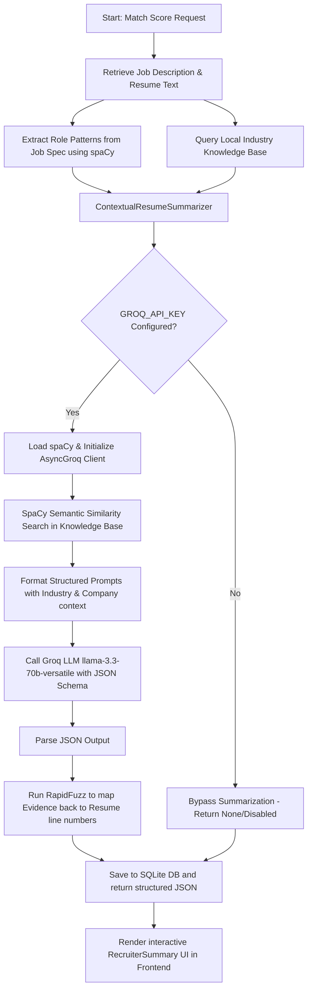

# HireMind — AI-Powered Resume Matcher & Recruiter Assistant

HireMind is a modern, high-performance web application designed to help recruiters screen hundreds of resumes efficiently. It automates candidate-to-job matching, extracts technical skills, highlights experience alignment, flags candidate potential concerns, and generates structured, role-specific recruiter summaries.

---

## 🚀 Key Features

*   **Smart Parsing & Skill Extraction**: Dynamically parses PDFs and Word documents (`.docx`), using rule-based and NLP tokenizers to extract candidate names and structured technical skills.
*   **Aesthetic Recruiter Dashboard**: Responsive dashboard showing detailed matching metrics, alignment scores, missing skills, and detailed analytics.
*   **Recruiter Evaluation Matrix**: An alignment view comparing candidate competency levels against job requirements with confidence metrics and gap mitigation guides.
*   **Potential Concerns & Interview Focus**: Flags candidate concerns (e.g., skill gaps, career shifts) and suggests numbered focus questions for recruiter interviews.
*   **Privacy-Centric Architecture**: Stores candidate data, job postings, and scoring records in a secure, local SQLite database.
*   **RAG-Powered LLM Summaries**: Employs Retrieval-Augmented Generation to contextually evaluate and summarize resumes using local industry benchmarks and the Groq API.

---

## 🏗️ Project Architecture

HireMind uses a full-stack, modular architecture:

```
├── backend/                       # Python FastAPI Backend
│   ├── app/
│   │   ├── data/                  # Knowledge base and static data
│   │   │   ├── industry_knowledge_base.json
│   │   │   └── skills.json
│   │   ├── services/              # Core business services
│   │   │   ├── matcher.py         # In-memory skills alignment & scoring
│   │   │   ├── skill_extractor.py # Regex/SpaCy skill parsing
│   │   │   ├── summarizer.py      # RAG-based Groq summarizer service
│   │   │   └── text_extractor.py  # PDF/DOCX text parsing
│   │   ├── routers/               # API endpoint routers (jobs, resumes, matching)
│   │   ├── database.py            # SQLite async engine and SQLAlchemy models
│   │   ├── models.py              # Pydantic schemas
│   │   └── main.py                # FastAPI app initialization
│   ├── requirements.txt           # Python backend dependencies
│   └── venv/                      # Local python virtual environment
│
└── frontend/                      # React SPA Frontend
    ├── public/                    # Favicon, assets
    ├── src/
    │   ├── components/            # Reusable UI widgets & Layouts
    │   │   ├── common/            # RecruiterSummary, SkillsBadge
    │   │   └── layout/            # Navbar, Sidebar, Layout structure
    │   ├── pages/                 # Full screens (Dashboard, Jobs, Resumes, Match, History)
    │   ├── hooks/                 # Custom TanStack query hooks
    │   ├── services/              # Axios configuration and API routing
    │   ├── types/                 # TypeScript typings
    │   ├── index.css              # Styling sheets
    │   └── main.tsx               # App entrypoint
    ├── package.json               # Node packages and build scripts
    └── vite.config.ts             # Vite server config
```

---

## 🧠 RAG (Retrieval-Augmented Generation) Architecture

To generate professional, context-rich candidate summaries, HireMind employs a custom local RAG architecture. This ensures that the generated summary is grounded in domain knowledge base constraints and aligned with industry standards.

### 📋 RAG Process Workflow



### 🔍 Breakdown of the RAG Steps

1.  **Role Pattern Extraction**:
    The system reads the job description and uses **spaCy** syntax parsing to identify sentence constructs emphasizing critical conditions (e.g. sentences containing *"must have"*, *"required"*, *"responsible for"*, *"qualification"*).
2.  **Semantic Document Similarity (Vector Search)**:
    Using the spaCy `en_core_web_lg` vector model, the candidate's target job title is compared against categories inside a local knowledge base (`industry_knowledge_base.json`). This knowledge base contains curated context:
    *   **Industry Benchmarks**: Standards for specific technical roles.
    *   **Career Paths**: Guidance on seniority tiers, promotions, and scale expectations.
    *   **Company Context**: Focus areas like agility, participation in code reviews, and remote collaboration.
    *   **Red Flags**: Critical concerns (e.g., job-hopping, gaps, lack of metrics).
3.  **Prompt Augmentation**:
    The retrieved context vector items and extracted job requirements are compiled alongside the candidate's resume (truncated to fit model limits) into a structured markdown prompt.
4.  **JSON Schema Enforcement**:
    The prompt requests structured output matching a precise JSON structure. The Groq client enforces `response_format={"type": "json_object"}` using the ultra-fast `llama-3.3-70b-versatile` model.
5.  **Evidence Citation (RapidFuzz)**:
    Once the LLM returns the structured evaluation evidence, the system runs **RapidFuzz** (token ratio-based string distance) to match the LLM's evidence sentences back to the candidate's original resume file, outputting exact line location citations (e.g., *"Line 24, Experience/Details"*).

---

## 🛠️ Installation & Setup

### Prerequisites
*   Python 3.10 or higher
*   Node.js v18 or higher

### Backend Setup
1.  Navigate to the backend directory:
    ```bash
    cd backend
    ```
2.  Create a virtual environment and activate it:
    ```bash
    python -m venv venv
    source venv/bin/activate  # On Windows: venv\Scripts\activate
    ```
3.  Install dependencies:
    ```bash
    pip install -r requirements.txt
    ```
4.  Configure your environmental variables:
    Create a `.env` file in the `backend/` directory:
    ```env
    GROQ_API_KEY=your_groq_api_key_here
    ```
    *Note: If `GROQ_API_KEY` is omitted, the application will disable LLM summarization on startup and run in standalone matching score mode.*
5.  Start the FastAPI application reload server:
    ```bash
    uvicorn app.main:app --reload
    ```
    The backend server will run on `http://127.0.0.1:8000`.

### Frontend Setup
1.  Navigate to the frontend directory:
    ```bash
    cd ../frontend
    ```
2.  Install npm packages:
    ```bash
    npm install
    ```
3.  Start the development server:
    ```bash
    npm run dev
    ```
    The application interface will be accessible at `http://localhost:5173`.
